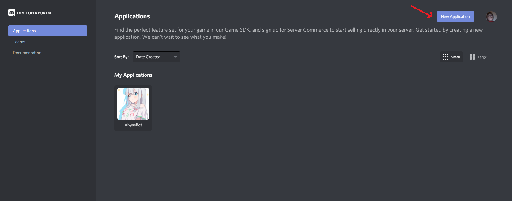
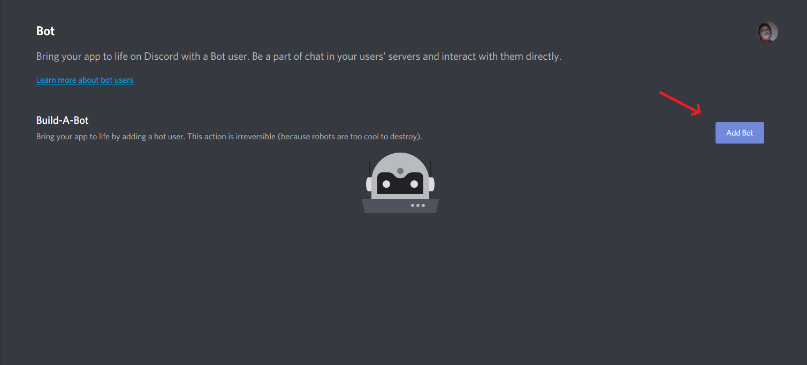
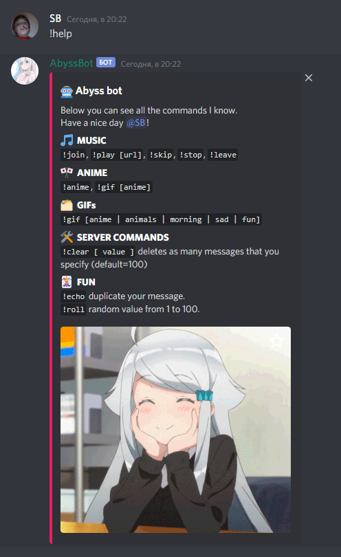
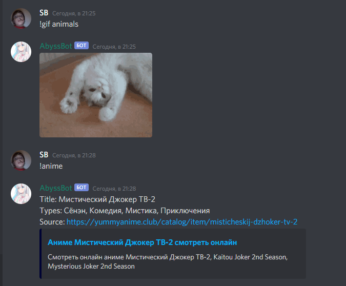
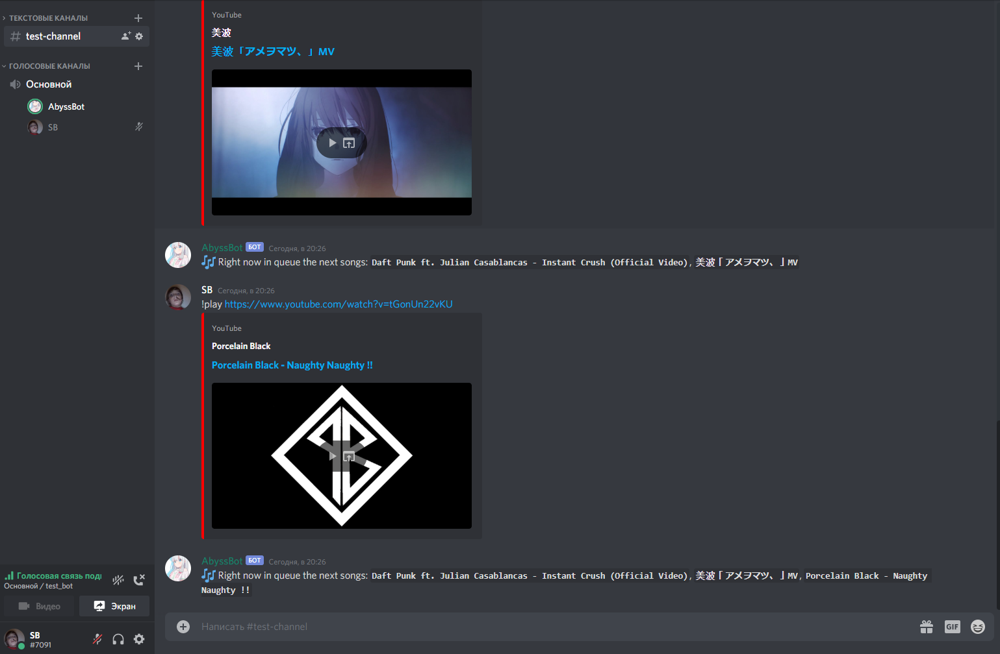

# AbyssBot
A simple music bot on Python using API of discord.py.

You can see the Bot commands in the preview section.

# Installation

### Discord developer portal
First you need to go to the following [link](https://discord.com/developers/applications) to create a new application. 

Select **New Application**:



Then you will need to create a Bot. To do so, select **Add Bot**:



### Python modules
Make sure Python 3.7+ and pip are installed. Run:

```pip install -r requirements.txt```

### FFmpeg
To convert and transfer audio files you need a library **FFmpeg**.

You can download **FFmpeg** from the following [link](https://ffmpeg.org/download.html).

# Bot preview
**```!help```** allows view all Bot commands.



**```!gif```** - Random GIF from the selected category, **```!anime```** - Random title.



**```!play```** allows Bot to join the voice channel and play the selected video in **m4a** format.



After use the **```!play```** command will add the specified audio to the music queue.
